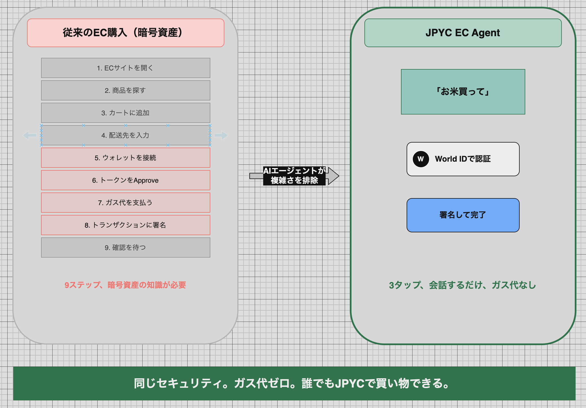
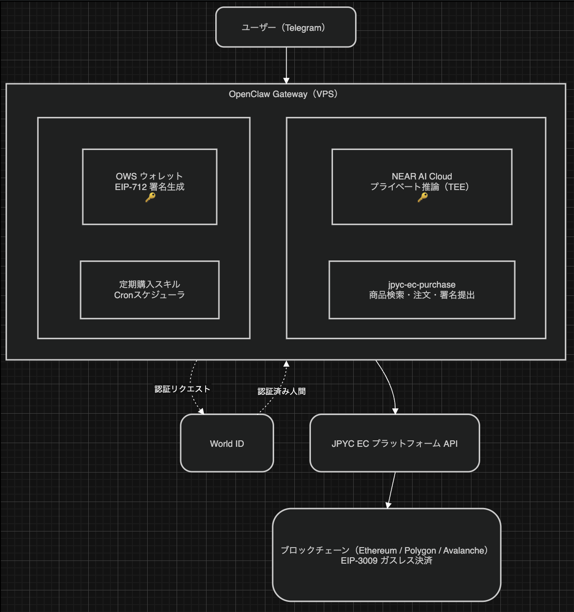
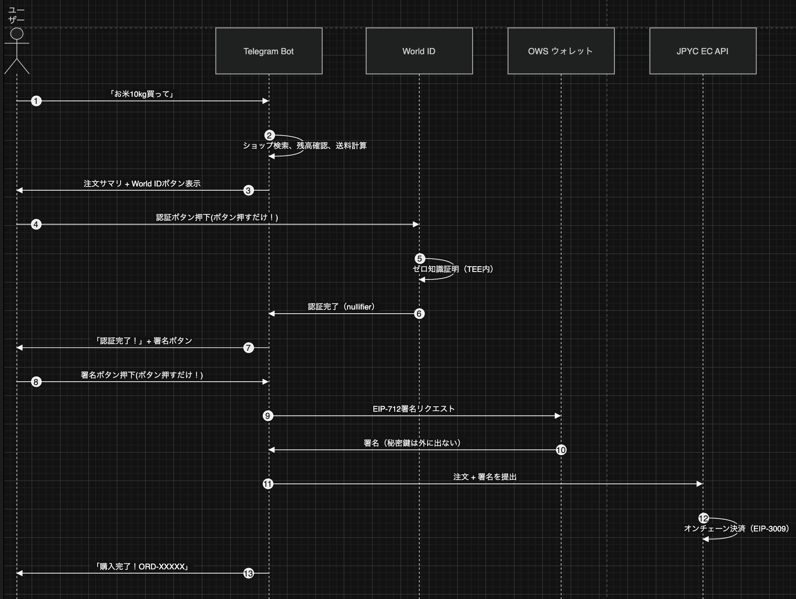
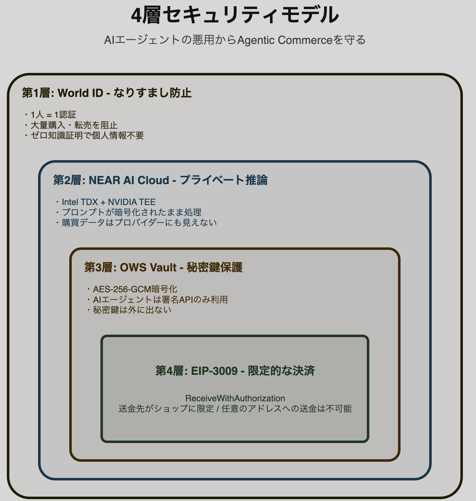

# JPYC EC Agent

AIエージェントがJPYCステーブルコインでECサイトから自律的に商品を購入するシステム。

Telegram Bot経由で「お米買って」と話しかけるだけで、商品検索 → 残高確認 → 送料計算 → EIP-3009署名 → 注文完了まで全自動で実行します。

**AI推論はNEAR AI CloudのPrivate Inference（TEE）内で実行され、ユーザーの個人情報・決済データはプロバイダーにも一切公開されません。**

## Demo

Telegram Botに話しかけてください:

<p align="center">
  
</p>

**Bot**: [@mameta_jpyc_ec_bot](https://t.me/mameta_jpyc_ec_bot)

---

## 9ステップ → 3タップ

<p align="center">
  
</p>

従来の暗号資産EC購入には9ステップと専門知識が必要でした。JPYC EC Agentは**会話するだけ、3タップ、ガス代ゼロ**で購入を完結します。

---

## Architecture

<p align="center">
  
</p>

---

## Purchase Flow

<p align="center">
  
</p>

ユーザーの操作は3回だけ。残りは全てAIが自動実行します。

1. **「お米10kg買って」** — Telegramでメッセージを送る
2. **World IDボタンを押す** — 本人確認 + 購入承認（ゼロ知識証明）
3. **署名ボタンを押す** — EIP-3009ガスレス決済を実行

---

## Key Features

- **World ID本人認証**: 購入前にWorld IDで「実在する人間」であることを証明。AIエージェントの悪用・転売目的の大量購入を防止
- **プライバシー保護された推論**: NEAR AI Cloud Private Inference（Intel TDX + NVIDIA TEE）でユーザーの購入データが暗号化されたまま処理
- **ガスレス決済**: EIP-3009による署名ベースの送金。ユーザーはガス代不要
- **オンチェーンサブスク決済**: ブロックチェーンでは不可能だった定期購入を、AIエージェント + Cronスケジューラで実現
- **秘密鍵の安全管理**: OWS (Open Wallet Standard) がAES-256-GCMで暗号化保管。エージェントは署名APIのみを呼び出し、秘密鍵に直接アクセスしない
- **対話型UX**: Telegramでの自然な日本語会話で購入フロー全体を完結
- **マルチチェーン対応**: JPYC ECはEthereum, Polygon, Avalancheに対応（デモはSepolia testnet）

---

## Why World ID? — AIエージェント時代の転売・買い占め防止

AIエージェントが自律的に購入できる世界では、新たなリスクが生まれます：

> 悪意あるユーザーが複数のAIエージェントを同時起動 → 人気商品を大量購入 → 転売で利益を得る → 一般消費者が買えなくなる（2024-2025年の日本のお米騰貴と同じ構造）

World IDは**「1人1認証」を暗号学的に保証**します：

| 対策 | 仕組み |
|---|---|
| **Sybil耐性** | 1つのWorld IDで1回のみ認証可能。複数アカウントによる買い占めを阻止 |
| **プライバシー保護** | ゼロ知識証明により、個人情報を一切開示せずに「人間である」ことだけを証明 |
| **Botフィルタリング** | Orb認証済みの人間だけが購入可能。自動化された買い占めBotを排除 |
| **アクション単位の制御** | アクションごとにnullifierが異なるため、同じ人が同じ商品カテゴリを重複購入することを防止可能 |

**AIエージェントに「手足」を与えるなら、「誰の手足か」を証明する仕組みが不可欠。**

---

## Why NEAR AI Cloud? — 購買データのプライバシー保護

AIエージェントが決済を代行する場合、配送先住所・購入金額・ウォレットアドレス・署名パラメータなどの機密情報がAIモデルに送信されます。

通常のAPIではプロバイダーがこれらを平文で受け取りますが、NEAR AI CloudのPrivate Inferenceでは **Intel TDX + NVIDIA TEEの暗号化環境内** で推論が実行され、NEAR自身を含め誰もプロンプトを閲覧できません。

**Agentic Commerceの実用化には、「AIが何を買ったか」を知られない仕組みが必要です。**

---

## オンチェーンサブスク決済の実現

ERC-20トークンはpull型決済ができないため、ブロックチェーンでの定期購入は事実上不可能でした。

| 従来のオンチェーン | JPYC EC Agent |
|---|---|
| サブスク不可能（pull型決済不可） | AIがCronで毎月自動署名 |
| 毎回手動署名 + ガス代 | EIP-3009でガスレス自動実行 |
| Approve全額許可はリスク | OWSが安全に署名代行 |
| 継続課金モデル不可 | MRR（月次リカーリング収益）実現 |

ユーザーは「毎月お米買って」と一度言うだけ。AIが毎月自動で署名・決済を実行します。

---

## 4-Layer Security Model

<p align="center">
  
</p>

---

## Skills

| Skill | Description |
|---|---|
| [jpyc-ec-purchase](skills/jpyc-ec-purchase/SKILL.md) | JPYC ECの購入フロー全体（API呼び出し、署名、注文） |
| [recurring-purchase](skills/recurring-purchase/SKILL.md) | OpenClaw cronによる定期購入スケジューリング |
| [ows](skills/ows/SKILL.md) | OWSウォレット管理・EIP-712署名生成 |

## Tech Stack

| Component | Technology |
|---|---|
| Identity | [World ID](https://world.org/world-id) (Zero-Knowledge Proof of Personhood) |
| AI Runtime | [OpenClaw](https://github.com/openclaw/openclaw) |
| AI Inference | [NEAR AI Cloud](https://cloud.near.ai) (Private Inference / TEE) |
| LLM | Claude Sonnet 4.5 (via NEAR AI Cloud) |
| Messaging | Telegram Bot API |
| Wallet | [OWS (Open Wallet Standard)](https://openwallet.sh) |
| Payment | EIP-3009 (ReceiveWithAuthorization) |
| Stablecoin | JPYC (JPY Coin) |
| EC Platform | [JPYC EC](https://stg-ec.jpyc-service.com) |
| Hosting | ConoHa VPS (Ubuntu 24.04) |

## Setup

### Prerequisites

- Node.js 22+
- pnpm
- OWS CLI (`curl -fsSL https://docs.openwallet.sh/install.sh | bash`)
- OpenClaw (`git clone https://github.com/openclaw/openclaw && pnpm install && pnpm build`)
- Telegram Bot Token (via [@BotFather](https://t.me/BotFather))
- NEAR AI Cloud API Key (from [cloud.near.ai](https://cloud.near.ai))

### 1. Install Skills

```bash
git clone https://github.com/Mameta29/clawathon.git
cp -r clawathon/skills/* ~/.agents/skills/
```

### 2. Create OWS Wallet

```bash
ows wallet create --name jpyc-agent
```

### 3. Configure OpenClaw

```bash
# Set Telegram bot token
pnpm openclaw config set channels.telegram.botToken "YOUR_BOT_TOKEN"
pnpm openclaw config set channels.telegram.enabled true

# Set NEAR AI Cloud as inference provider
pnpm openclaw config set agents.list.0.model nearai/anthropic/claude-sonnet-4-5

# Optimize: disable unnecessary plugins
pnpm openclaw config set plugins.allow '["anthropic","telegram"]'

# Optimize: disable extended thinking
pnpm openclaw config set agents.defaults.thinkingDefault off
pnpm openclaw config set agents.list.0.thinkingDefault off
```

### 4. Run

```bash
pnpm openclaw gateway run --allow-unconfigured
```

### Performance Optimization

VPS (1GB RAM) での運用時、以下の最適化で応答時間を **75秒 → 7秒** に短縮:

| Optimization | Before | After | Impact |
|---|---|---|---|
| Plugin allowlist (`anthropic` + `telegram` only) | 117 plugins loaded | 2 plugins loaded | -25s |
| Remove unused provider extensions from `dist/` and `dist-runtime/` | 60+ providers loaded per message | 0 extra providers | -20s |
| `thinkingDefault: off` | 21s thinking overhead | 0s | -21s |
| Sonnet (vs Opus) | Slow generation | Fast generation | -5s |

## Hackathon

**Clawathon Tokyo Edition** (Next AI Leaders Hackathon)

- Track: **On-chain Settlement for AI** - エージェントによるステーブルコイン決済の自動執行
- NEAR Award: **Best Agentic Commerce Use Case** + **Best NEAR Tech Integration**
- World Award: **World ID** による本人認証で転売・買い占め防止

## License

MIT
